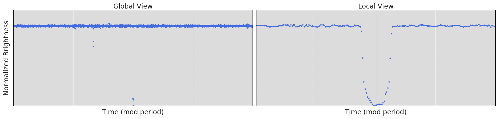
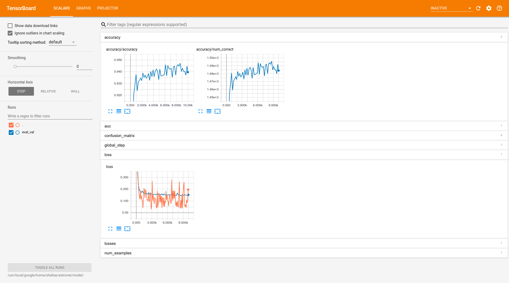

# Richard Piccioni's fork of AstroNet-Triage: A Neural Network for TESS Light Curve Triage

Richard Piccioni: rpiccioni@marin.edu

*meta note: I am tring to document here my efforts to get these programs to run under Windows Subsystem for Linux (WSL).  See also my Google colaboratory notebook *`drpAstronet_Triage`*. - rgp*


## Background

This directory contains TensorFlow models and data processing code for
identifying exoplanets in astrophysical light curves. For complete background on how CNNs work for planet detection, see [Shallue & Vanderburg's paper](http://adsabs.harvard.edu/abs/2018AJ....155...94S) in
*The Astronomical Journal*. This is the triage version of our two TESS neural networks. For the vetting verison, see https://github.com/yuliang419/Astronet-Vetting.

For shorter summaries, see:

* ["Earth to Exoplanet"](https://www.blog.google/topics/machine-learning/hunting-planets-machine-learning/) on the Google blog
* [This blog post](https://www.cfa.harvard.edu/~avanderb/page1.html#kepler90) by Andrew Vanderburg
* [This great article](https://milesobrien.com/artificial-intelligence-gains-intuition-hunting-exoplanets/) by Fedor Kossakovski
* [NASA's press release](https://www.nasa.gov/press-release/artificial-intelligence-nasa-data-used-to-discover-eighth-planet-circling-distant-star) article

## Citation

A paper that summarizes this code is available [here](https://arxiv.org/abs/1904.02726) and at [*The Astronomical Journal*](https://iopscience.iop.org/article/10.3847/1538-3881/ab21d6). Please cite it if you make use of this code:

Yu, L. et al. (2019). Identifying Exoplanets with Deep Learning III: Automated Triage and Vetting of TESS Candidates. *The Astronomical Journal*, 158(1), 25.

See also the original Shallue & Vanderburg paper:

Shallue, C. J., & Vanderburg, A. (2018). Identifying Exoplanets with Deep
Learning: A Five-planet Resonant Chain around Kepler-80 and an Eighth Planet
around Kepler-90. *The Astronomical Journal*, 155(2), 94.

Full text available at [*The Astronomical Journal*](http://iopscience.iop.org/article/10.3847/1538-3881/aa9e09/meta).

## Code Directories

[astronet/](astronet/)

* [TensorFlow](https://www.tensorflow.org/) code for:
  * Downloading and preprocessing TESS data.
  * Building different types of neural network classification models.
  * Training and evaluating a new model.
  * Using a trained model to generate new predictions.

[light_curve_util/](light_curve_util)

* Utilities for operating on light curves. These include:
  * Reading TESS data from `.h5` files.
  * Phase folding, splitting, binning, etc.
* In addition, some C++ implementations of light curve utilities are located in
[light_curve_util/cc/](light_curve_util/cc).

[third_party/](third_party/)

* Utilities derived from third party code.


## Walkthrough

### Install Required Packages

First, ensure that you have installed the following required packages:

* **TensorFlow** ([instructions](https://www.tensorflow.org/install/)) *rgp Note: use* `conda install -c conda-forge tensorflow=1.15.00` 
* **Pandas** ([instructions](http://pandas.pydata.org/pandas-docs/stable/install.html)) *rgp Note: use* `conda install -c conda-forge pandas=0.25`
* **NumPy** ([instructions](https://docs.scipy.org/doc/numpy/user/install.html))
* **AstroPy** ([instructions](http://www.astropy.org/))
* **PyDl** ([instructions](https://pypi.python.org/pypi/pydl))
* rgp Note: also need statsmodels* `conda install -c conda-forge statsmodels'

### Download TESS Data 

*Note: The code in this section (**Download TESS DATA**) will not run without the tsig module, which is not available to non-MIT users. See email from Andrew Vanderburg - rgp*

A *light curve* is a plot of the brightness of a star over time. We will be
focusing on light curves produced by the TESS space telescope. An example
light curve (produced by Kepler) is shown below.


To train a model to identify planets in TESS light curves, you will need a
training set of labeled *Threshold Crossing Events* (TCEs). A TCE is a periodic
signal that has been detected in a Kepler light curve, and is associated with a
*period* (the number of days between each occurrence of the detected signal),
a *duration* (the time taken by each occurrence of the signal), an *epoch* (the
time of the first observed occurrence of the signal), and possibly additional
metadata like the signal-to-noise ratio. An example TCE is shown below. The
labels are ground truth classifications (decided by humans) that indicate which
TCEs in the training set are actual planets signals and which are caused by
other phenomena.


*rgp insert from https://ui.adsabs.harvard.edu/abs/2019AAS...23314004G/abstract*

*The Transiting Exoplanet Survey Satellite (TESS) is NASA's newest exoplanet hunter. Launched in the spring of 2018, TESS began its two-year science mission to image nearly the entire sky on July 25, 2018. Each observing sector lasts for two ~13 day orbits. At perigee, data is downlinked back to MIT's Payload Operations Center (POC) through the Deep Space Network. The POC converts the data and delivers it to the NASA Ames Science Processing Operations Center (SPOC) where it is calibrated and sent through their pipeline. The pipeline searches for threshold crossing events (TCEs) in the 2-minute postage stamp data. Concurrently at MIT, the 30-minute full-frame images are sent through MIT's Quick Look Pipeline to search for additional TCEs. TCEs with high enough significance are converted into a data validation report. These reports are then fed into MIT's TESS Exoplanet Vetter (TEV). TEV is a web-based tool that allows human vetters to view the reports and easily share their assessment with the rest of the vetting team. Vetting is split into two stages. First, each object is reviewed by up to four individual vetters to determine its disposition. Potential dispositions are Planet Candidate, Eclipsing Binary, Stellar Variability, Instrument Noise, Other Astrophysical, and Undecided. Next, objects that are potential Planet Candidates are sent to a group review for further validation. Planet Candidates that survive group review are quickly shared with the community and the TESS Follow-up Observing Program (TFOP). TFOP coordinates observations of these candidates to confirm and characterize them as planets or reject them as false positives. The TESS Objects of Interest (TOI) Catalog is crafted from the final dispositions of each object, excluding signals caused by instrument noise. The TOI Catalog will be made public no later than January 2019 on the MIT TESS website and ExoFOP-TESS.*

*end of insert*


**The CSV creation step needs to be run on PDO, but I have included the complete CSV file (`astronet/tces.csv`) that I used to train the model.**

*rgp: What does it mean 'run on PDO'?*

The TESS TCE lists for each sector are available on the TEV website. Download them as CSVs, and run `make_catalog.py` in the `data` folder to create a catalog that combines all sectors. e.g.:

```
python make_catalog.py --input sector-1-earlylook.csv sector-2-bright.csv sector-3-01.csv sector-3-02.csv --num_worker_processes=20 --base_dir=[wherever your csv file is] --out_name=tces.csv
```
The output will be a CSV file named `tces.csv` (in the same directory as your input CSV file) with the following columns:

* `row_id`: Integer ID of the row in the TCE table.
* `tic_id`: TIC ID of the target star.
* `toi_id`: TCE number within the target star. These are structured funny so we'll ignore them for now.
* `Disposition`: Final disposition from group vetting (should be one of the following: PC (planet candidate), EB (eclipsing binary), IS (instrumental noise), V (variability), O (other), J (junk). The J class includes a mix of V and IS. I didn't distinguish all of them since these two are always lumped together anyway.
* `RA`: RA in degrees.
* `DEC`: Dec in degrees.
* `Tmag`: TESS magnitude.
* `Epoc`: The time corresponding to the center of the first detected
event in Barycentric Julian Day (BJD) minus a constant offset.
* `Period`: Period of the detected event, in days.
* `Duration`: Duration of the detected event, in hours.
* `Transit Depth`: Transit depth in ppm.
* `Sectors`: Sector number.
* `camera`: Camera number.
* `ccd`: CCD number.
* `star_rad`, `star_mass`, `teff`, `logg`: Stellar parameters from Gaia DR2 or the TIC. Since a lot of TCEs are missing these values, we're not using them right now.
* `SN`: Signal-to-pink noise ratio from BLS.
* `q_ingress`: Fractional ingress duration from VARTOOLS.

The catalog creation step may take a while to run, depending on how many TCEs there are. For entire sectors, I'd recommend using at least 20 workers in parallel, or it will take forever. Set `num_worker_processes` to 1 to turn off multiprocessing.

Light curves are stored as h5 files on PDO, in e.g. `/pdo/qlp-data/sector-2/ffi/cam1/ccd1/LC/ `. Download all the light curves you need from one sector and store them in a local directory called `astronet/tess/sector-X` (no need to subdivide by camera and ccd).

*rgp: what does that mean, exactly? Where is `/pdo/qlp-data/sector-2/ffi/cam1/ccd1/LC/ ` ?*

If working with TCEs that are not available on TEV, start by creating a .txt file of TIC IDs of all TCEs that you wish to include, and name the file `sector-x-yyy.txt`, where `x` is the sector number and `yyy` is an optional string. Then run `make_empty_catalog.py` in the `data` directory to create a csv file in a specified location (named `sector-X-all.csv`) with only a few columns filled in, e.g.:

```
python make_empty_catalog.py --base_dir=[wherever you text file is] --input sector-4-bad.txt sector-4-good.txt --save_dir=[wherever you want to save the output]
```

Note that the csv file created this way will have a disposition of `J` for all TCEs, because I mostly used this to create catalogs of junk that didn't make it to group vetting.

Then, run `make_catalog.py` as usual to create a CSV file with the rest of the columns filled in.


### Process TESS Data

**All the following steps can be run on any computer that has TESS h5 files stored in a single folder, divided by sector. If you don't have access to the original h5 files, I have included all the TFRecords used in my paper under `astronet/tfrecords` so you can skip the training set generation step.**

*I don't think I have access to the TESS h5 files. For one thing, the original repo does not even have a subdirectory called *`astronet/tess`*, which is where those files would be stored.  So skip to **Train an Astronet Model**, below. Note I did get the light-curve display code at the end of this section to run in my Google colab notebook, *`drpAstronet_Triage`* as well as in WSL (presumably, since there were not error messages).  Apparently WSL cannot display graphical output.*

To train a model to identify exoplanets [*as we do in the next section*], you [*first*] need to provide TensorFlow
with training data in [TFRecord](https://www.tensorflow.org/guide/datasets) format. The
TFRecord format consists of a set of sharded files containing serialized
`tf.Example` [protocol buffers](https://developers.google.com/protocol-buffers/).

The command below will generate a set of sharded TFRecord files for the TCEs in
the training set. Each `tf.Example` proto will contain the following light curve
representations:

* `global_view`: Vector of length 201: a "global view" of the TCE.
* `local_view`: Vector of length 81: a "local view" of the TCE.

In addition, each `tf.Example` will contain the value of each column in the
input TCE CSV file, including transit and stellar parameters.

Disclaimer: I haven't figured out how to make Bazel work, so just use the plain python version for now.

To generate the training set:
```bash
# The original Astronet used Bazel, but we could just invoke the source scripts with the 
# following addition to PYTHONPATH:
export PYTHONPATH="/path/to/source/dir/:${PYTHONPATH}"

# Filename containing the CSV file of TCEs in the training set.
TCE_CSV_FILE="astronet/tces.csv"

# Directory to save output TFRecord files into.
TFRECORD_DIR="astronet/tfrecord"

# Directory where light curves are located.
TESS_DATA_DIR="astronet/tess/"
  
# Run without bazel
python astronet/data/generate_input_records.py \
--input_tce_csv_file=${TCE_CSV_FILE} \
--tess_data_dir=${TESS_DATA_DIR} \
--output_dir=${TFRECORD_DIR} \
--num_worker_processes=5 
```

If `--clean` is included as an argument, the train and validation sets will only contain TCEs with S/N above some threshold (specified by the `--threshold` argument, default 15).

If the optional `--make_test_set` argument is included, the code will generate 8 test sets instead of 8 training, 1 validation and 1 test. This is useful for creating test sets out of new data and using them to evaluate a model trained on older data. Setting `--clean` here would produce test sets containing only TCEs with S/N above some threshold.

When the script finishes you will find 8 training files, 1 validation file and
1 test file in `TFRECORD_DIR`. The files will match the patterns
`train-0000?-of-00008`, `val-00000-of-00001` and `test-00000-of-00001`
respectively.

Here's a quick description of what the script does. For a full description, see
Section 3 of [our paper](http://iopscience.iop.org/article/10.3847/1538-3881/aa9e09/meta).

For TESS light curves, background variability has already been removed (mostly), so the spline-fitting step in the original paper is not necessary. 

For each TCE in the input CSV table, we generate two representations of
the light curve of that star. Both representations are *phase-folded*, which
means that we combine all periods of the detected TCE into a single curve, with
the detected event centered.

Here's an example of the generated representations (Kepler-90 g) in the output.

*rgp: As noted above, I did get a modified version of the following to work in Google colab *`drpAstronet_Triage`*.  I note some especially significant edits here as well.*

```python
# Launch iPython (or Python) from the tensorflow_models/astronet/ directory.
ipython

In[1]:
import matplotlib.pyplot as plt
import numpy as np
import os.path
import tensorflow as tf

In[2]:
#TIC_ID = 270341214 NOT IN THE DATASET - rgp
TIC_ID = 350146577
TFRECORD_DIR = "/path/to/tfrecords/dir"

In[3]:
# Helper function to find the tf.Example corresponding to a particular TCE.
def find_tce(tic_id, filenames):
  for filename in filenames:
    for record in tf.python_io.tf_record_iterator(filename):
      ex = tf.train.Example.FromString(record)
      if ex.features.feature["tic_id"].int64_list.value[0] == tic_id:
        print("Found {} in file {}".format(tic_id, filename))
        return ex
# I changed the indent level of the following line two steps leftward - rgp
  raise ValueError("{} not found in files: {}".format(tic_id, filenames))

In[4]:
# Find sample TCE
filenames = tf.gfile.Glob(os.path.join(TFRECORD_DIR, "*"))
assert filenames, "No files found in {}".format(TFRECORD_DIR)
ex = find_tce(TIC_ID, filenames)

In[5]:
# Plot the global and local views.
global_view = np.array(ex.features.feature["global_view"].float_list.value)
local_view = np.array(ex.features.feature["local_view"].float_list.value)
fig, axes = plt.subplots(1, 2, figsize=(20, 6))
axes[0].plot(global_view, ".")
axes[1].plot(local_view, ".")
plt.show()
```

The output should look something like this:



### Train an AstroNet Model

*rgp: After lots of struggling, I did get the following to run (or at least appear to run) in WSL.  See my bash script and sample output, below.*

The [astronet](astronet/) directory contains several types of neural
network architecture and various configuration options. This particular version is configured to detect objects that can plausibly be planets (including PCs and EBs whose stellar variability amplitudes are less than half the depths of the eclipses).
To train a convolutional
neural network to classify TESS TCEs as either "likely planet" or "not planet",
using the best configuration from
[our paper](http://iopscience.iop.org/article/10.3847/1538-3881/aa9e09/meta),
run the following training script:

```bash
# Directory to save model checkpoints into.
MODEL_DIR="astronet/model/"
  
# Run without Bazel
python astronet/train.py \
--model=AstroCNNModel \
--config_name=local_global \
--train_files=${TFRECORD_DIR}/train* \
--eval_files=${TFRECORD_DIR}/val* \
--model_dir=${MODEL_DIR} \
--train_steps=14000
  
```
Optionally, you can also run a [TensorBoard](https://www.tensorflow.org/guide/summaries_and_tensorboard)
server in a separate process for real-time
monitoring of training progress and evaluation metrics.

```bash
# Launch TensorBoard server.
tensorboard --logdir ${MODEL_DIR}
```

The TensorBoard server will show a page like this:



The "loss" plot shows both training and validation losses. The optimum number of training steps is where validation loss reaches a minimum.

*Here is the script I ran in WSL and a tiny fragment of the hours of screen output generated before my keyboard interrupt:*

```# The original Astronet used Bazel, but we could just invoke the source scripts with the
# following addition to PYTHONPATH:
export PYTHONPATH="/astronet/:${PYTHONPATH}"

# Filename containing the CSV file of TCEs in the training set.
TCE_CSV_FILE="astronet/tces.csv"

# Directory to save output TFRecord files into.
TFRECORD_DIR="astronet/tfrecord"

# Directory where light curves are located.
TESS_DATA_DIR="astronet/tess/"

# Directory to save model checkpoints into.
MODEL_DIR="astronet/model/"

# Run without Bazel
python astronet/train.py \
--model=AstroCNNModel \
--config_name=local_global \
--train_files=${TFRECORD_DIR}/train* \
--eval_files=${TFRECORD_DIR}/val* \
--model_dir=${MODEL_DIR} \
--train_steps=14000
```

```
  File "/home/drpiccioni/Astronet-Triage/astronet/ops/training.py", line 106, in create_train_op
    transform_grads_fn=transform_grads_fn)
  File "/home/drpiccioni/anaconda3/envs/tf/lib/python3.7/site-packages/tensorflow_core/contrib/training/python/training/training.py", line 450, in create_train_op
    colocate_gradients_with_ops=colocate_gradients_with_ops)
  File "/home/drpiccioni/anaconda3/envs/tf/lib/python3.7/site-packages/tensorflow_core/python/training/optimizer.py", line 512, in compute_gradients
    colocate_gradients_with_ops=colocate_gradients_with_ops)
  File "/home/drpiccioni/anaconda3/envs/tf/lib/python3.7/site-packages/tensorflow_core/python/ops/gradients_impl.py", line 158, in gradients
    unconnected_gradients)
  File "/home/drpiccioni/anaconda3/envs/tf/lib/python3.7/site-packages/tensorflow_core/python/ops/gradients_util.py", line 707, in _GradientsHelper
    in_grad.set_shape(t_in.get_shape())
  File "/home/drpiccioni/anaconda3/envs/tf/lib/python3.7/site-packages/tensorflow_core/python/framework/ops.py", line 582, in get_shape
    return self.shape
  File "/home/drpiccioni/anaconda3/envs/tf/lib/python3.7/site-packages/tensorflow_core/python/framework/ops.py", line 471, in shape
    self._shape_val = self._c_api_shape()
  File "/home/drpiccioni/anaconda3/envs/tf/lib/python3.7/site-packages/tensorflow_core/python/framework/ops.py", line 497, in _c_api_shape
    return tensor_shape.TensorShape(shape_vector)
  File "/home/drpiccioni/anaconda3/envs/tf/lib/python3.7/site-packages/tensorflow_core/python/framework/tensor_shape.py", line 757, in __init__
    elif isinstance(dims, tensor_shape_pb2.TensorShapeProto):
KeyboardInterrupt
```

*In WSL, this also appeared to run, though crashing after a minute or two:*

```
# rgpTenBrd
MODEL_DIR="astronet/model/"
# launch TensorBoard server.
```

### Model Averaging
You can train a set of 10 models with random initializations and average their outputs when making predictions. This helps prevent overfitting and makes the model more robust. To do this, use the following command:

```bash
./astronet/ensemble_train.sh ${MODEL_DIR} 14000 ${TFRECORD_DIR}
```
The 14000 here is the number of train steps I used for each model. The code will produce 10 subdirectories under `${MODEL_DIR}`.

A fully trained, averaged model can be found under `astronet/models_final`.

### Evaluate an AstroNet Model

Run the following command to evaluate a model on the test set. The result will
be printed on the screen, and a summary file will also be written to the model
directory, which will be visible in TensorBoard.

```bash
  
# Run evaluation script
python astronet/evaluate.py \
--model=AstroCNNModel \
--config_name=local_global \
--eval_files=${TFRECORD_DIR}/test* \
--model_dir=${MODEL_DIR}
```

The output should look something like this:

```bash
INFO:tensorflow:Saving dict for global step 10000: accuracy/accuracy = 0.9625159, accuracy/num_correct = 1515.0, auc = 0.988882, confusion_matrix/false_negatives = 10.0, confusion_matrix/false_positives = 49.0, confusion_matrix/true_negatives = 1165.0, confusion_matrix/true_positives = 350.0, global_step = 10000, loss = 0.112445444, losses/weighted_cross_entropy = 0.11295206, num_examples = 1574.
```

To plot the misclassified TCEs and calculate precision and recall at various thresholds, do the following:

```bash
python astronet/find_incorrect.py --model_dir=${MODEL_DIR} --tfrecord_dir=${TFRECORD_DIR} --suffix=yyy --average
```

This produces plots of the global and local views of misclassified TCEs in a folder called `astronet/plots` and generates a text file called `true_vs_pred_yyy.txt` with two columns: the true disposition of each TCEs in the test set (0 = junk, 1 = PC or EB), the predicted probability of each TCE being a positive. If you trained an ensemble of models and want to use model averaging, include a `--average` argument and make sure `${MODEL_DIR}` is set to the directory that contains the 10 subdirectories. If there's no `--average` argument, `${MODEL_DIR}` is just the directory containing your single model.

To plot the precision-recall curve, run `plot_roc.py` with the appropriate true_vs_pred file (you'll have to modify the code directly).


### Make Predictions

The easiest way to make predictions for a list of new TCEs is to run `generate_input_records.py` following instructions above with the `--make_test_set` argument included, such that all the new TCEs to be classified are stored as tfrecords. Then run the following:

```bash
# Make a directory for plots
mkdir astronet/plots
SAVE_DIR=astronet/plots

# Generate a prediction for a list of new TCEs.
python astronet/batch_predict.py \
  --model_dir=${MODEL_DIR} \
  --tfrecord_dir=${TFRECORD_DIR} \
  --suffix=yyy \
  --average \
  --plot \
  --save_dir=${SAVE_DIR}
```

If the option `--plot` argument is included, you must also include a `--save_dir`. Plots of the global and local views of TCEs in the test set will be saved under that directory.

If you trained an ensemble of models and want to use model averaging, include a `--average` argument and make sure `${MODEL_DIR}` is set to the directory that contains the 10 subdirectories. If there's no `--average` argument, `${MODEL_DIR}` is just the directory containing your single model.

The output of this step is a file called `prediction_yyy.txt`, saved in your current directory. This file contains the TIC ID of each object in your input list, and the model's prediction of the object being a plausible planet candidate. In this version (triage), that means the object is likely either a PC or an EB without too much stellar activity. 
